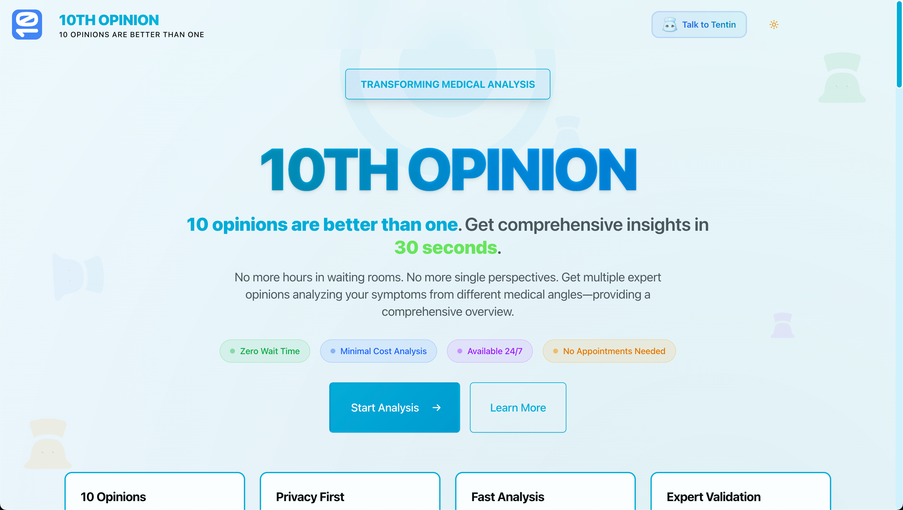

# 10TH OPINION - Medical Consensus

A medical AI diagnostic system that uses 10 agents running on AWS Bedrock to analyze patient symptoms and provide diagnostic assessments.



Try now at [10TH OPINION](10thopinion.com)!

## Overview

This system implements a multi-agent consensus protocol where 10 AI agents with different specializations analyze patient data in phases. The agents are divided into four groups: blind diagnosticians (independent analysis), informed analysts (build on previous opinions), scrutinizers (quality control), and a final authority (synthesis).

### Technical Characteristics

- 10 agents run in 4 phases using AWS Bedrock Claude models
- Response time: 30-60 seconds for complete analysis
- Session data persists in DynamoDB for 24 hours then auto-deletes
- File uploads stored temporarily in S3 with presigned URLs
- System prompt engineering defines agent behavior, not model selection
- Includes fallback JSON parsing for handling malformed agent responses
- Mobile-responsive web interface built with Next.js 15.3
- Mobile-optimized version with camera integration for field use
- Email delivery option via AWS SES for poor network conditions
- Network-aware features detect 2G/3G/4G connections

## Architecture

### Agent Structure

```
1. Blind Diagnosticians (Agents 1-4) - Independent Analysis
   - First Opinion: Pattern Recognition
   - Second Opinion: Differential Diagnosis
   - Third Opinion: Rare Disease Specialist
   - Fourth Opinion: Holistic Assessment

2. Informed Analysts (Agents 5-7) - Sequential Review
   - Fifth Opinion: Consensus Builder
   - Sixth Opinion: Devil's Advocate
   - Seventh Opinion: Evidence Validator

3. Scrutinizers (Agents 8-9) - Quality Control
   - Eighth Opinion: Hallucination Detector
   - Ninth Opinion: Bias Auditor

4. Final Authority (Agent 10) - Weighted Synthesis
   - Tenth Opinion: Comprehensive Assessment
```

### Technology Stack

- Frontend: Next.js 15.3.4, React 19.0.0, TypeScript 5.8.3, Tailwind CSS 4.1.10
- Backend: Next.js API Routes, AWS SDK v3
- AI Models: AWS Bedrock Claude models (Haiku, Sonnet 4, Opus 4)
- Storage: S3 for temporary files, DynamoDB for session data
- Logging: AWS CloudWatch
- Package Manager: Bun 1.2.15

## Setup

### Requirements

- Bun 1.2.15 or later
- AWS Account with Bedrock model access enabled
- AWS credentials with permissions for Bedrock, S3, DynamoDB, and CloudWatch

### Installation

```bash
# Clone repository
git clone [repository-url]
cd tenthopinion

# Install dependencies
bun install

# Configure environment
cp .env.example .env
# Edit .env with your AWS credentials and configuration
```

### Required Environment Variables

```env
# AWS Configuration
AWS_REGION=us-east-1
AWS_ACCESS_KEY_ID=[your_key]
AWS_SECRET_ACCESS_KEY=[your_secret]

# Storage Configuration
S3_BUCKET_NAME=[your-bucket-name]
DYNAMODB_TABLE_NAME=TenthOpinionSessions
DYNAMODB_ANALYTICS_TABLE_NAME=TenthOpinionSessions-Analytics

# Model Configuration
MODEL_SETUP=minimal  # Options: minimal, dev, prod

# Email Configuration (AWS SES)
AWS_SES_FROM_EMAIL=tenthopinion@gmail.com
AWS_SES_REGION=us-east-1
```

### Running the Application

```bash
# Development server
bun dev

# Production build
bun run build
bun run start

# Run tests
bun test-bedrock.js       # Test Bedrock connectivity
bun test-full-protocol.js # Test complete agent flow
```

## AWS Configuration

### 1. Enable Bedrock Models

In AWS Console > Bedrock > Model access, enable:
- `us.anthropic.claude-opus-4-20250514-v1:0`
- `us.anthropic.claude-sonnet-4-20250514-v1:0`
- `us.anthropic.claude-3-5-haiku-20241022-v1:0`

### 2. Create Required Resources

```bash
# Run setup script
bash scripts/setup-aws.sh

# Setup email service (AWS SES)
bash scripts/setup-ses.sh

# Or manually create:
# S3 bucket with CORS and lifecycle rules
# DynamoDB table with TTL enabled
# CloudWatch log group
# SES email verification and configuration
```

### 3. IAM Permissions

Ensure your AWS credentials have:
- `bedrock:InvokeModel` on the Claude models
- S3 read/write on your bucket
- DynamoDB read/write on tables
- CloudWatch logs write permissions
- SES:SendEmail permission for email delivery

## Cost Estimates

### Model Tiers
- **minimal**: Claude 3.5 Haiku only - $0.01-0.02 per analysis
- **dev**: Claude Sonnet 4 only - $0.03-0.08 per analysis
- **prod**: Mix of Opus 4 and Sonnet 4 - $0.05-0.15 per analysis

### AWS Services (within free tier for moderate usage)
- S3: 5GB free storage, minimal cost for requests
- DynamoDB: 25GB free storage with on-demand pricing
- CloudWatch: 5GB free log ingestion

## System Design Details

### Agent Execution Flow

1. **Phase 1 (Parallel)**: 4 blind agents analyze independently
   - Pattern Recognition: Identifies common symptom patterns
   - Differential Diagnosis: Generates comprehensive condition list
   - Rare Disease Specialist: Checks for uncommon conditions
   - Holistic Assessment: Reviews patient history and context

2. **Phase 2 (Sequential)**: 3 informed agents build on Phase 1
   - Consensus Builder: Synthesizes blind opinions with meta-analysis
   - Devil's Advocate: Challenges assumptions and finds gaps
   - Evidence Validator: Checks against medical literature

3. **Phase 3 (Parallel)**: 2 scrutinizers perform quality control
   - Hallucination Detector: Identifies impossible diagnoses
   - Bias Auditor: Checks for demographic biases

4. **Phase 4**: Final authority synthesizes all opinions
   - Weights: 30% blind consensus, 25% validation, 25% scrutiny, 20% reasoning

### Technical Implementation Notes

- Retry logic with exponential backoff handles transient API failures
- JSON parsing includes fallback regex extraction for malformed responses
- Phase delays (1 second) prevent potential rate limiting
- Token optimization keeps prompts under model limits (800 tokens)
- Selective disclosure testing: Agent 1 randomly receives incomplete data
- Meta-scrutiny: Agent 5 analyzes Agent 1's reasoning process

## Data Handling

- Patient data stored in DynamoDB with 24-hour TTL
- Uploaded files in S3 auto-delete after 24 hours
- No personally identifiable information logged
- Sessions identified by random IDs only
- Analytics table stores aggregate metrics without patient data

## User Interface Components

### Tentin DDA (Diagnosis Discussion Agent)
- Post-analysis chat interface for follow-up questions
- Tabbed view showing all 10 agent opinions
- Expandable cards with full reasoning for each agent
- Context-aware responses about specific agent analyses
- Markdown support for formatted responses

### Main Analysis Flow
1. Patient fills symptom form with optional structured checklist
2. Real-time progress display shows each agent's status
3. Results presented with primary diagnosis and confidence
4. DDA chat activated for deeper exploration of results
5. Email delivery option for results when network connectivity is limited

### Mobile Application (/mobile)
- Optimized interface for smartphones and tablets
- Camera integration for capturing patient images or documents
- Network detection displays current connection type (2G/3G/4G)
- Email fallback automatically suggested for poor connectivity
- Touch-optimized controls and larger interaction targets
- Simplified navigation for field healthcare workers

## Performance Characteristics

- Full protocol execution: 30-60 seconds
- Individual agent response: 2-5 seconds
- Parallel phase completion: 5-8 seconds
- Sequential phase completion: 15-20 seconds
- JSON parsing success rate: 95%+ with fallback extraction

## Features for Field Use

### Network Awareness
- Automatic detection of connection type using Network Information API
- Visual indicators for 2G, 3G, 4G, and 5G networks
- Network quality assessment (poor/moderate/good/excellent)
- Automatic email fallback suggestion for poor connectivity

### Email Delivery
- AWS SES integration for reliable email delivery
- HTML-formatted results with medical disclaimers
- Plain text version for maximum compatibility
- Automatic sending when email provided in patient form
- Includes session ID for future reference

### Mobile Optimizations
- Touch-friendly interface with larger buttons
- Simplified navigation for one-handed use
- Camera integration for document capture
- Responsive design adapts to screen size
- Reduced data usage for slow connections

## Known Limitations

- Text-based analysis only (image upload stores but doesn't analyze)
- English language only
- No direct integration with medical records
- Requires active internet connection
- No offline functionality
- Limited to symptom-based analysis

## Debugging and Testing

```bash
# Test individual components
bun test-model-availability.js  # Check which models are accessible
bun test-agent-debug.js        # Test agent execution with delays
bun test-api-endpoint.js       # Test API endpoint directly

# Check logs
tail -f [terminal output]       # Real-time execution logs
# AWS CloudWatch for production logs
```

## License

MIT License - see LICENSE file for details.

## Medical Disclaimer

This system is for informational purposes only and does not constitute medical advice. Users should consult qualified healthcare providers for medical concerns. The system explicitly includes disclaimers in all responses and provides links to emergency services.
